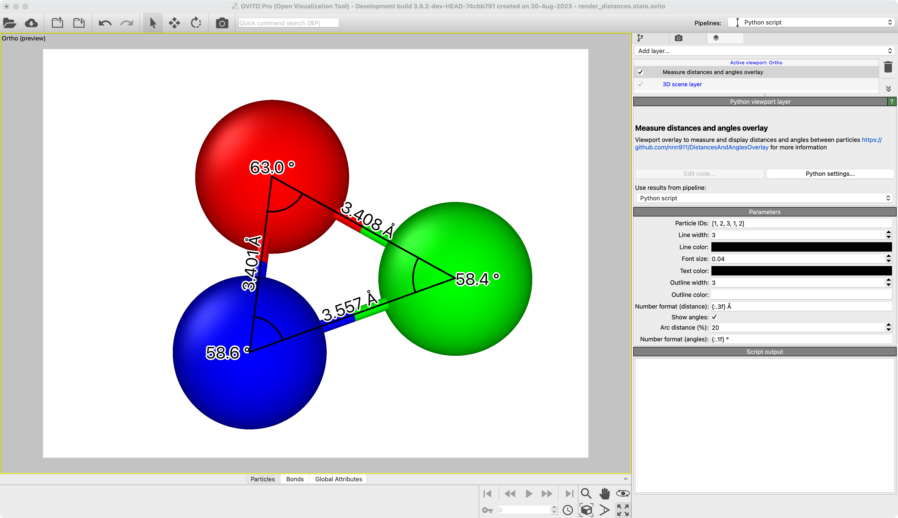

# Measure Distances And Angles Overlay
Measure both distances and angles between particles and display them as an overlay in the viewport.

## Description
TBD

## Parameters 
- "Particle IDs" | `particle_ids`: List of particle identifiers used as modifier input. The list is traversed in order and distances are measured between consecutive particles. If the last particle is equal to the first one, all interior angles will be measured.
- "Line width" | `line_width`: Width (in pixel) of all lines. Default = 3.
- "Line color" | `line_color`: Color of all lines. Default = (0, 0, 0).
- "Font size" | `font_size`: Font size for all text labels. Default = 0.05.
- "Text color" | `text_color`: Text color for all texts. Default = (0, 0, 0)
- "Outline width" | `outline_width`: Width (in pixel) of the text outline. A width of `0` corresponds to no outline. Default = 0.
- "Number format (distance)" | `distance_label_format`: Format specifier for the particle-particle distances. Default = "{:.3f}".
- "Show angles" | `show_angles`: Show angles between particles. Default = True.
- "Arc distance (%)" | `arc_distance`: Distance (in % of the particle-particle distance) in which the arc indicating the angles is displayed. Default = 20.
- "Number format (angles)" | `angle_format`: Format specifier for the angle measurements. Default = "{:.1f} °".

## Example



## Installation
- OVITO Pro [integrated Python interpreter](https://docs.ovito.org/python/introduction/installation.html#ovito-pro-integrated-interpreter):
  ```
  ovitos -m pip install --user git+https://github.com/nnn911/DistancesAndAnglesOverlay.git
  ``` 
  The `--user` option is recommended and [installs the package in the user's site directory](https://pip.pypa.io/en/stable/user_guide/#user-installs).

- Other Python interpreters or Conda environments:
  ```
  pip install git+https://github.com/nnn911/DistancesAndAnglesOverlay.git
  ```

## Technical information / dependencies
- Tested on OVITO version 3.9.2

## Contact
Daniel Utt utt@ovito.org